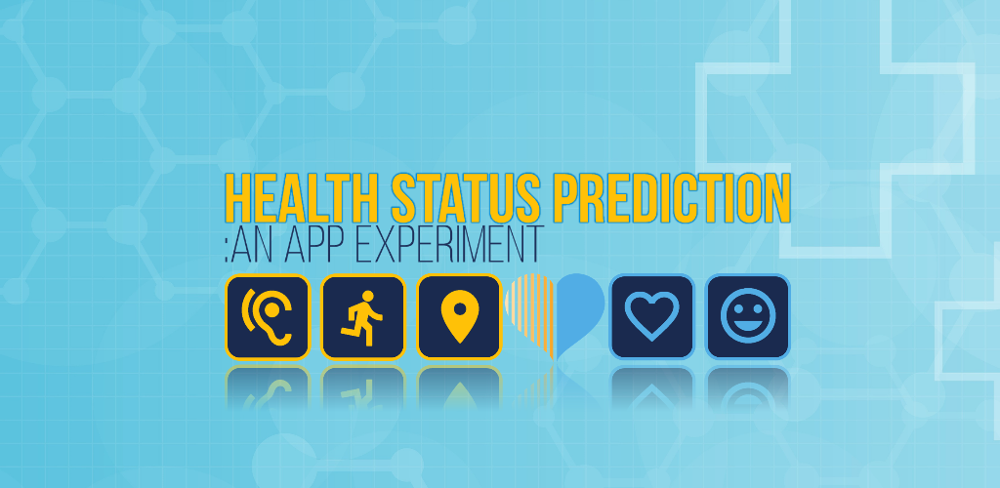
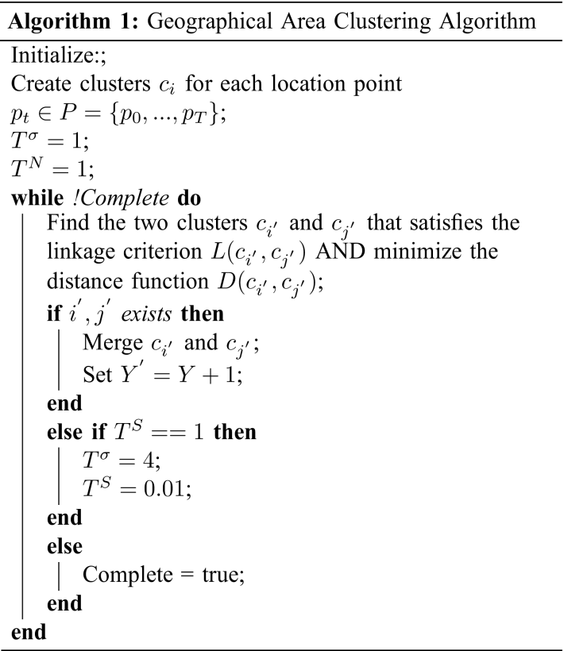
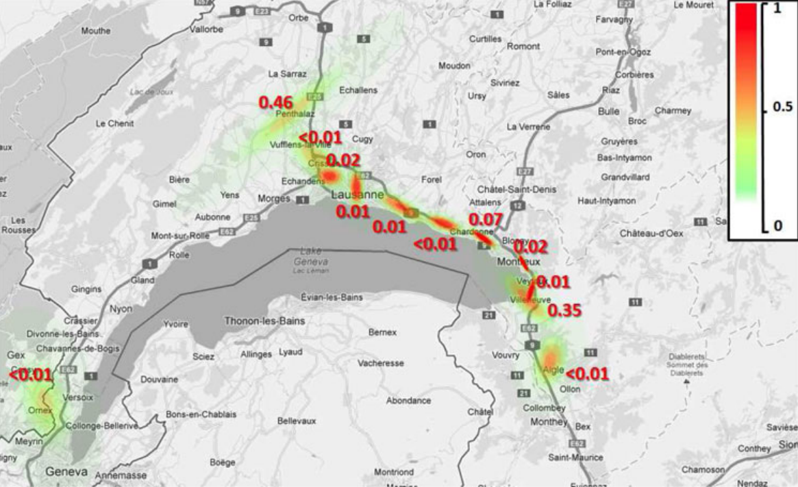

<h1 align="center"> Health-U: Human Behaviour Tracking for Health</h1>  

  

  A Data Science tool for:

  | Data Collection | Data Processing | Data Analysis |

  
  

<!-- START doctoc generated TOC please keep comment here to allow auto update -->
<!-- DON'T EDIT THIS SECTION, INSTEAD RE-RUN doctoc TO UPDATE -->
## Table of Contents

- [Introduction](#introduction)
- [Features](#features)
- [Data Processing](#data-processing)

<!-- END doctoc generated TOC please keep comment here to allow auto update -->

## Introduction

An App designed to support research into modelling human behaviour.
The App was designed to collect:
* Motion Sensor Data from Accelerometer/Gyroscope
* Sound Sensor Data from Microphone
* Location Sensor Data from GPS
* Health Status Data from user reported questionnaire

  

## Features

A few of the things Health-U does:

* Data Vizualization: Feedback on activity history
* Data Recording: Robust background services to record motion, location and sound
* Health Status Questionnaire
* Cloud Storage of Data for further analysis

  

## Unsupervised Learning
### Location Predictability:

Spatiotemporal movement of an individual, to and from different geographical locations, is regularly linked to particular patterns. How often, and to what extent, one deviates from their regular pattern could be a key attribute of a particular behavioral action. It is the measurement of this location predictability, or unpredictability, which is the basis for this technique.

The App records location data using a combination of a <a href="https://github.com/dnlkelly1/Health-U/blob/master/app/src/main/java/com/csri/ami/health_u/dataManagement/record/GPS_Sensor.java">GPS Sensor</a> and a <a href="https://github.com/dnlkelly1/Health-U/blob/master/app/src/main/java/com/csri/ami/health_u/dataManagement/record/wifi/WiFi_Sensor.java">WIFI sensor</a>. An overall Sensor Manager class co-ordinates between all individual sensor recorder classes to co-ordintate recording and manage power usage. GPS is switch off when in a known location based on a known WiFi BSSID location.

In order to calculate the predictability, or entropy, of an individuals' behavior, we must first consider how to model the probability distribution <strong>p()</strong>. Additionally, since the nature of location behavior is spatiotemporal, we must also consider how the temporal aspect of the individual's movement can be modeled. In this study, in order to account for both aspects of location behavior, we propose a two-stage location behavior model. In the first stage, probability models of a number of different geographical areas are calculated and following this, in the second stage, the temporal transitions of the individual between these geographical areas are modeled.

The <a href="https://github.com/dnlkelly1/Health-U/blob/master/app/src/main/java/com/csri/ami/health_u/dataManagement/analyze/dataAnalytics/processingTechniques/HierarchicalCluster.java">HierarchicalCluster class</a> manages the process of detecting geographical areas of interest for given user. This process is based on a hierarchical clustering algorthim:

  
  

Each location cluster is then modelled using a Probility Density Function (PDF) combining spatial probalility and time probability.

Hidden Markov Models represent an ideal framework to probabilistically model location behavior in a temporal context. An HMM is a collection of states that are connected by transitions. Each transition (or time step) has a pair of probabilities: a transition probability (the probability of taking a particular transition to a particular state) and an output probability (the probability of emitting a particular output symbol from a given state). From this description, it can be seen that HMMs fit our model of location behavior. Each geographic area can be represented by a state, and the output probability of the state can be modeled using the location PDF. Additionally, the temporal aspect of the location behavior can now be modeled by transitions between states. The <a href="https://github.com/dnlkelly1/Health-U/blob/master/app/src/main/java/com/csri/ami/health_u/dataManagement/analyze/dataAnalytics/processingTechniques/HMM_LocationEntropy.java">HMM_LocationEntropy</a> class builds the markov model from location clusters. Given a set of locations for a day, the predictability of those locations can then be computed using the modelled markov chain.

* More details on this technique can be found here: https://doi.org/10.1109/TSMC.2013.2238926

